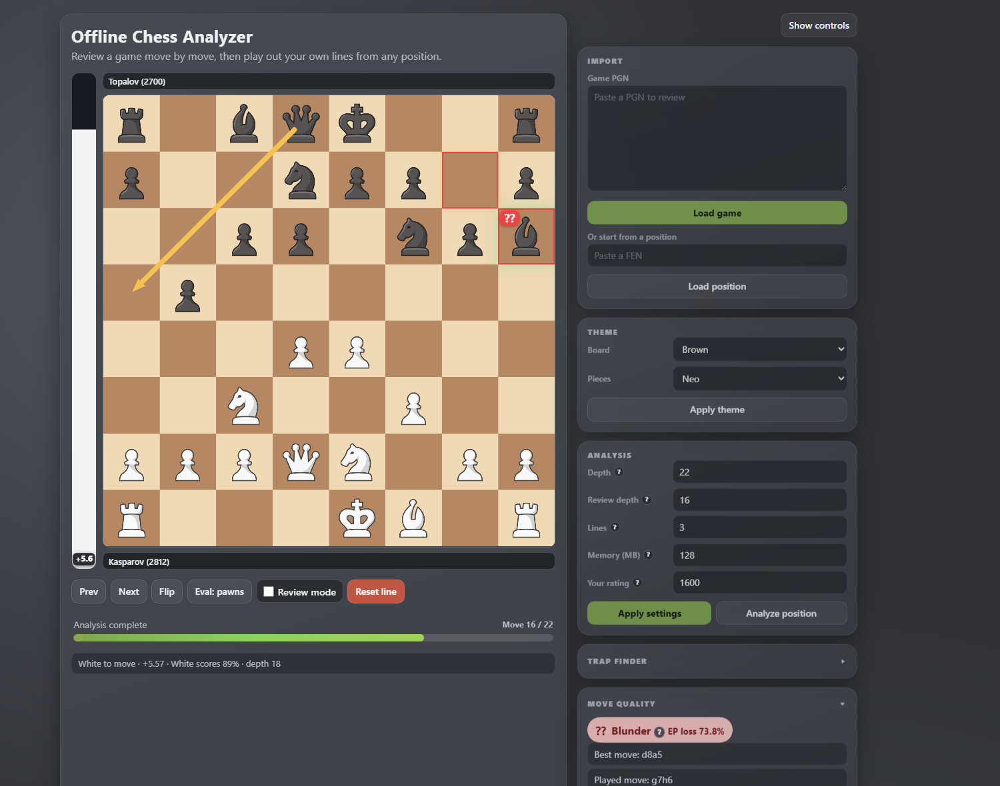

<div align="center">


# Offline Chess Analyzer

**A Firefox extension that reviews your chess games on your own machine — Stockfish in a WASM worker, an offline opening book, and not a single position leaving the browser.**

[](#install)
[](#engine-concurrency)
[](#privacy)
[](#testing)
[](#license)



</div>

---

## Contents

- [What it does](#what-it-does)
- [Install](#install)
- [Usage](#usage)
- [Keyboard shortcuts](#keyboard-shortcuts)
- [Settings](#settings)
- [How it works](#how-it-works)
  - [Expected points model](#expected-points-model)
  - [Best-move arrow](#best-move-arrow)
  - [Move tree](#move-tree)
  - [Engine concurrency](#engine-concurrency)
  - [Review performance](#review-performance)
  - [Parallelism](#parallelism)
  - [Trap finder](#trap-finder)
- [Importing from chess.com](#importing-from-chesscom)
- [Privacy](#privacy)
- [Project layout](#project-layout)
- [Development](#development)
  - [Testing](#testing)
  - [Tools](#tools)
- [Troubleshooting](#troubleshooting)
- [License](#license)

---

## What it does

The extension opens **its own analysis page** — it does not overlay chess.com or any other site — and runs the
engine inside that page. Load a game and every move is graded; step through it, or stop anywhere and play your
own line to see where the alternative would have gone.

#### Review

- **Whole-game review** that classifies every move with an Expected Points model, running across a pool of engines.
- **Real opening-book classification** (`Book`) from an offline ECO database, not a guess from move numbers.
- **Terminal positions decided by the rules** — checkmate, stalemate and draws are scored directly instead of
  being handed to the engine.
- **Evaluation bar and timeline scrubber**, in pawns or expected points.

#### Explore

- **Interactive what-if play** from any position in the game, including underpromotion.
- **An unbounded move tree** — every alternative you play becomes a variation under the move it branched from.
- **Live MultiPV analysis** of the position on the board, with a best-move arrow.
- **Board and piece themes**, board flip, and a reset that drops back to the reference line.

#### Prepare

- **[Trap finder](#trap-finder)** — moves that are sound for you *and* that opponents at your rating tend to
  answer badly, found by crossing the Lichess opening explorer with the local engine.

#### Import

- **PGN paste**, or a custom start **FEN**.
- **Player Elo picked up from the PGN tags** (`WhiteElo` / `BlackElo`) when they are there.
- **One-click import from a chess.com archive** — see [Importing from chess.com](#importing-from-chesscom).

---

## Install

The extension is unsigned, so it loads as a temporary add-on and stays until Firefox restarts.

1. Open Firefox and go to `about:debugging`.
2. Click **This Firefox**.
3. Click **Load Temporary Add-on…**.
4. Select `manifest.json` from this folder.
5. Click the extension's toolbar icon to open the analyzer page.

There is no build step: the extension ships the sources it runs.

---

## Usage

1. Paste a PGN and click **Load game**, or paste a FEN and click **Load position**.
2. Loading a PGN starts a whole-game review that classifies every move. Any navigation stops it.
3. Move around with **Prev/Next**, the arrow keys, the timeline scrubber, or the move tree.
4. Click a piece and then a target square to play an alternative move; pawn promotions open a piece picker.
5. Read the live analysis lines and the move-quality verdict in the side panel.
6. Adjust depth / lines / memory / rating and click **Apply settings**.
7. To prepare an opening, open **Trap finder**, paste a Lichess token once, navigate to the position you want
   to prepare, and click **Find traps**.

---

## Keyboard shortcuts

| Key | Action |
| --- | --- |
| `←` / `→` | Previous / next move |
| `Home` / `End` | Jump to the start / end of the line |
| `F` | Flip the board |
| `Esc` | Clear the selected piece, or close the open dialog |
| `Q` `R` `B` `N` | Pick a piece in the promotion dialog |

---

## Settings

| Setting | Default | Range | What it affects |
| --- | --- | --- | --- |
| **Depth** | `22` | 12–30 | The position on the board — the interactive analysis you watch. |
| **Review depth** | `16` | 10–26 | The whole-game pass only. See [Review performance](#review-performance). |
| **Lines** | `3` | 1–4 | MultiPV for the board position. |
| **Memory (MB)** | `128` | 64–512 | Engine hash. Kept modest on purpose: large hashes crash the WASM build. |
| **Your rating** | `1600` | 400–3000 | Picks the opponent pool the [trap finder](#trap-finder) searches. Auto-filled from PGN Elo tags. |

**Apply settings** pushes Hash / Threads / MultiPV to the worker with `setoption` and clears the analysis
cache, so a changed setting takes effect on the next search rather than at the next page load. On lower-end
machines, drop the depth to 18–20.

Everything is stored in `chrome.storage.local`, including the board and piece theme.

---

## How it works

### Expected points model

Centipawn scores are mapped to white's winning chances with:

```
p_white = 50 + 50 * ((2 / (1 + exp(-0.00368208 * cp_white))) - 1)
```

A move is then graded by how much expected score *the player who made it* threw away:

| Label | Expected-points loss | Notes |
| --- | --- | --- |
| `Book` | — | Found in the offline ECO database |
| `Best` | ~0 | The top engine move |
| `Excellent` | ≤ 2% | |
| `Good` | ≤ 5% | |
| `Inaccuracy` | ≤ 10% | |
| `Mistake` | ≤ 20% | |
| `Blunder` | > 20% | |
| `Great` / `Brilliant` | — | Heuristic; needs a third line to establish |

### Best-move arrow

The arrow answers *"what was the best move at this ply?"* — the strongest alternative to the move you are
looking at — so it is computed from the position that move was played **from**, exactly like the `Best move:`
line in the move-quality panel. The two can never disagree.

- At the root there is no played move, so the arrow shows the best move from the position on the board.
- When the played move already was the best one, no arrow is drawn; the board tag already says so.
- A candidate that is not legal in the position it is measured against is discarded rather than drawn, so an
  arrow belonging to another ply can never reach the screen.

This is review framing, not exploration framing: the arrow tells you what should have been played, not what to
play next. It can therefore start from a square the played move has since vacated.

### Move tree

The tree renders a reference spine — the loaded PGN mainline, or the first line played when starting from a
FEN — with every alternative shown as an indented variation beneath the move it branches from.

Two rules keep it honest as variations accumulate:

- A move's variations are *every child except the one that continues the line currently being rendered*. At the
  end of a line there is no such continuation, so all children are variations. Deriving this from the rendered
  path — rather than guessing a "main child" — is what keeps a move played from the final position visible.
- A variation is expanded when the user opened it **or** when it contains the current move. Since navigating to
  a node promotes the whole path to it, the move you just played is always on screen without hiding behind a
  collapsed toggle; step back onto the mainline and it folds away again, with the toggle reporting how many
  lines it holds.

Nesting is unbounded — indentation comes from the containing block, not from per-depth CSS classes. Chips are
labelled in SAN (`Nf3`, not `g1f3`) and carry their classification icon once scored.

### Engine concurrency

Only one search may run in a worker at a time. `StockfishClient` therefore keeps a single active request plus
at most one queued request: a newer `analyze()` call stops the running search, rejects it with
`Canceled by newer request.`, and waits for the engine's terminating `bestmove` before starting the next
search. Without that wait, the stopped search's `bestmove` would resolve the *next* request with an empty
result — a flat `0.00` evaluation and a best-move arrow belonging to the previous position.

Above that, the app never runs two analysis pipelines at once: the whole-game scan and the move classifier own
the engine while they run, and both re-schedule a position analysis when they finish. Any user navigation
(arrow keys, scrubber, tree jump, or playing a move) cancels a running scan so it cannot move the board out
from under the click.

### Review performance

A whole-game review used to run every position at the depth and line count chosen for the interactive board.
Nothing needs depth 22 with three lines to sort a move into one of seven expected-point buckets, and on the
single-threaded engine this extension ships, that profile costs about 4.3 s per move.

The review now has its own, cheaper profile:

| | 24-ply game | per move |
| --- | --- | --- |
| Old — review at board settings (depth 22, 3 lines), one engine | 104.4 s | 4.35 s |
| New — review at depth 16, 2 lines, one engine | 12.0 s | 0.50 s |

Running that review across the engine pool cuts it by a further ~3.4×; see [Parallelism](#parallelism).

Measured with `tools/bench-scan.mjs` against the same `stockfish-18-lite-single` build the extension loads.
Three changes get there:

- **A separate review depth.** `tools/bench-accuracy.mjs` scores a shallow review against a deep one, move by
  move. Across a quiet grandmaster game and a sharp game full of real blunders, depth 16 never changed which
  moves were flagged as inaccuracies, mistakes or blunders. The drift is confined to the fine gradation between
  `Best`, `Excellent` and `Good`, plus some `Great` labels a shallow search cannot establish. Raise **Review
  depth** for a slower, stricter pass.
- **Two lines instead of three.** The third line only decides `Great` and `Brilliant`, so it is fetched on
  demand for the handful of moves that claim one, rather than paid for on every move.
- **The playback beat overlaps the search.** The board animation used to run to completion before the engine
  was asked anything, adding its delay to every ply.

The review already costs one search per ply rather than two: each ply's resulting position is the next ply's
starting position, so the result is carried forward.

### Parallelism

Stockfish can search on several threads, but that build needs `SharedArrayBuffer`, which requires the page to
be cross-origin isolated. `tools/probe/run-probe.mjs` loads the real extension in the real Firefox and reports
what the page can actually do. The answer is unambiguous:

```
crossOriginIsolated  false
SharedArrayBuffer    undefined
threaded build       WORKER ERROR ReferenceError: SharedArrayBuffer is not defined
```

Adding Chrome's `cross_origin_embedder_policy` / `cross_origin_opener_policy` manifest keys changes nothing in
Firefox, and neither does flipping the related browser prefs. Extension pages cannot set COOP/COEP response
headers, so internal engine threads are simply unavailable.

The parallelism comes from the other direction instead. A review is a pile of positions that do not depend on
one another, so rather than one engine with many threads it runs **many single-threaded engines, one position
each** (`app/engine-pool.mjs`). Measured inside Firefox on a 16-core machine, 25 positions at the review
profile:

| engines | time |
| --- | --- |
| 1 | 9.95 s |
| 6 | 2.91 s |

That is a **3.4×** speedup — the same order internal threading would have given, with no `SharedArrayBuffer`
involved. The pool takes `cores - 1`, capped at six (beyond that the extra engines stop paying for themselves)
and shares the configured memory budget between them rather than giving each one the full amount. It starts
when a review starts and is disposed when the review ends, so idle memory is unchanged.

Combined with the cheaper review profile, a whole-game review went from roughly 4.3 s per move to well under
half a second.

### Trap finder

A trap has two halves, and neither is visible from one source alone. The engine knows which replies are
objectively losing but has no idea which of them anyone would ever play. The opening explorer knows exactly
which replies humans at a given rating choose but has no idea which of them are bad. Intersect the two and what
is left is the thing worth learning: **a reply that is both popular and losing**.

That is the whole design, and it is why no scraping is involved. One explorer request returns the aggregated
move distribution over millions of games at a chosen rating band and time control, so a search costs a handful
of requests rather than a download of anybody's game archive.

For the position on the board, the finder:

1. asks the explorer which moves are actually played here, and takes the most common as candidates;
2. asks the explorer, once per candidate, how the opponent pool replies to it;
3. evaluates the whole tree in one batch across the engine pool;
4. keeps candidates that are sound for you and that a meaningful share of opponents answer badly.

Expected points are zero-sum, so what the opponent gives up on a reply is exactly what you pick up; the two are
the same number and are only computed once. Each candidate is scored by

> **expected gain = Σ (share of opponents playing the reply × expected score that reply throws away)**

shrunk toward zero for thin samples, so a 20-game line cannot outrank a 20,000-game one on a fluke. The panel
also reports how the side setting the trap has *actually* scored after each losing reply — independent
corroboration that the engine's verdict shows up on the scoreboard.

Clicking a move plays it on the board, so the line can be explored, or searched again one move deeper.

#### The token

The explorer required no login until it was hit by request floods in early 2026; it now answers `401` without
one. The panel therefore needs a free **Lichess personal access token**, created at
[`lichess.org/account/oauth/token`](https://lichess.org/account/oauth/token) with **no scopes ticked**. It is
stored in `chrome.storage.local` alongside the other settings and is sent only to `explorer.lichess.org`.

#### Not getting banned

Lichess pays for the aggregation this feature reads, and the explorer has already been taken down once by
request floods. The client is built to be a good citizen first and fast second:

- **One request in flight, ever.** Every call joins a single promise chain.
- **A floor of 1.2 s between requests** (`EXPLORER_MIN_INTERVAL_MS`).
- **A 429 stops the search.** Lichess asks for a full minute of silence afterwards, so the client records the
  cooldown, refuses to send anything until it expires, and does *not* retry. Partial results are kept and shown.
- **A hard request budget per search** — default 14, visible in the panel.
- **The smallest useful response**: `topGames` and `recentGames` are pinned to `0`, because game references are
  the expensive half of the payload and the search never reads them.
- **Everything is cached**, in memory and on disk, keyed by position with the move counters stripped so
  transpositions hit the same entry. Entries live 30 days.

A fresh search from a common position costs about **11 requests and 15 seconds**. The same search again costs
**nothing at all**.

---

## Importing from chess.com

Optional, and the only other place the extension touches the network. On a chess.com **games archive** page a
content script adds an **Offline Review** button to each row. Clicking it:

1. opens that game in a background tab with a capture flag,
2. lifts the PGN out of the page,
3. hands it to the background script, which replaces that tab with the analyzer page and loads the game.

Nothing is uploaded; the PGN travels from one tab to another through `chrome.storage.local`.

---

## Privacy

The analysis is entirely local: the engine is a WASM worker inside the extension page, the opening book is a
bundled ECO database, and no position, evaluation or game is ever sent anywhere.

Two features talk to the network, both explicitly:

| Feature | Host | Sends |
| --- | --- | --- |
| [Trap finder](#trap-finder) | `explorer.lichess.org` | The position being prepared, plus your token |
| [chess.com import](#importing-from-chesscom) | `chess.com` | Nothing — it only reads a page you opened |

---

## Project layout

Everything in this repository is ES modules; `package.json` declares `"type": "module"` so Node reads the
sources the same way the browser does.

```
manifest.json          MV3 config: CSP for WebAssembly, COOP/COEP attempts, content scripts
background/            toolbar click → analyzer page; PGN hand-off between tabs
content/               chess.com archive button and PGN capture
engine/                Stockfish 18 WASM builds (lite, single-threaded)
vendor/chess.js        local chess rules/parser library (ES module)
assets/                knight icon, board textures, piece sets
app/                   the analyzer page
tools/                 benchmarks, the Firefox capability probe, the screenshot renderer
tests/                 node:test suite, no browser required
```

<details>
<summary><b>Inside <code>app/</code></b></summary>

<br />

| File | Role |
| --- | --- |
| `analyzer.html`, `styles.css` | The page itself |
| `main.js` | Thin browser entrypoint that bootstraps the app |
| `core/analyzer-app.mjs` | Composition root and orchestration flow |
| `core/controllers/analysis-controller.mjs` | Analysis scheduling, caching, classification, the mainline scan pipeline |
| `core/controllers/gameplay-controller.mjs` | Playback, navigation, keyboard control, board interaction |
| `core/controllers/trap-controller.mjs` | Trap panel wiring, engine-pool hand-off, cancellation |
| `core/constants.mjs` | Defaults and shared constants |
| `core/browser-storage.mjs` | Async wrappers over `chrome.storage.local` |
| `stockfish-client.mjs` | UCI wrapper over a Stockfish worker, including search serialization |
| `engine-pool.mjs` | Several single-threaded engines running at once for a review |
| `analysis-pipeline.mjs`, `analysis-fallback.mjs` | Search scheduling, and progressively lighter retry profiles on timeout or crash |
| `move-classifier.mjs` | Expected-score transform and move labels |
| `opening-book.mjs`, `opening-book-data.mjs` | Offline ECO lookup by position and by move |
| `terminal-position.mjs` | Rule-based evaluation for finished positions |
| `pgn-loader.mjs` | PGN parsing and tag extraction |
| `state/tree-state.mjs` | Move-tree state transitions and line synchronization |
| `traps/trap-finder.mjs` | The trap search itself — no DOM, no network, no engine; the explorer and the evaluator are injected, which is what lets the tests drive it deterministically |
| `traps/explorer-client.mjs` | Rate-limited, authenticated Lichess explorer client |
| `traps/explorer-cache.mjs` | Memory + `chrome.storage.local` cache, so repeat searches send nothing |
| `ui/*` | DOM refs and rendering: board, tree, classification, overlays, panels |

</details>

---

## Development

### Testing

```bash
npm install
npm test
```

The suite runs on Node's built-in test runner and needs no browser:

| Test | Covers |
| --- | --- |
| `app-boot.test.mjs` | Boots the real `analyzer.html` and `analyzer-app.mjs` in jsdom against a fake Stockfish worker, then drives the page the way a user does — load PGN, click squares, flip, reset, keys |
| `live-moves.test.mjs` | The real controllers headlessly: branching, classification, scan takeover |
| `stockfish-client.test.mjs` | The UCI client through a mock worker, including search cancellation |
| `engine-pool.test.mjs` | Job settlement, including a run superseded mid-flight |
| `trap-finder.test.mjs` | Ranking, the soundness filter, sample-size shrinkage, the request budget, the rate-limit path |
| `explorer-client.test.mjs` | The request floor, the 429 cooldown, token handling and the cache — against a fake clock, so nothing waits on real time |
| `trap-panel.test.mjs` | The panel through the real page, with only the network replaced |
| `best-move-arrow.test.mjs`, `move-tree.test.mjs`, `panel-layout.test.mjs` | Arrow provenance, tree structure, panel layout |
| `pgn-parse.test.mjs`, `opening-book-classification.test.mjs`, `terminal-position.test.mjs`, `analysis-*.test.mjs` | PGN parsing, the opening book, terminal scoring, the fallback profiles |

### Tools

These run against the real engine.

| Command | What it does |
| --- | --- |
| `node tools/bench-scan.mjs` | Review speed, per move and per game |
| `node tools/bench-accuracy.mjs` | What a shallower review costs in labels, scored against a deep one |
| `node tools/bench-pool.mjs` | Pool scaling across engine counts |
| `node tools/snapshot.mjs out.png` | Renders the real page to a PNG for looking at UI changes (headless Edge) |
| `node tools/probe/run-probe.mjs` | Loads the extension in real Firefox and reports what the page can actually do — threading, `SharedArrayBuffer`. It swaps the manifest while it runs and restores it afterwards |

---

## Troubleshooting

- **Open the extension page's devtools** and watch the logs prefixed with `[app]` and `[engine:ui]`.
- **Engine worker crash** — the app restarts the worker on its own and reports a readable status error.
  Repeated crashes usually mean the hash is too large; drop **Memory** back toward 128 MB.
- **Nothing changes after editing settings** — click **Apply settings**, then **Analyze position** to force a
  fresh search.
- **Threads stay at 1** — expected. See [Parallelism](#parallelism): Firefox extension pages cannot be
  cross-origin isolated, so the single-threaded build is the only one that runs.
- **Trap finder returns 401** — the Lichess token is missing or invalid. Create a new one with no scopes ticked.
- **Trap finder stops early** — the request budget ran out, or Lichess returned a 429 and the client is sitting
  out its cooldown. Whatever was found by then is still shown.

---

## License

ISC.
